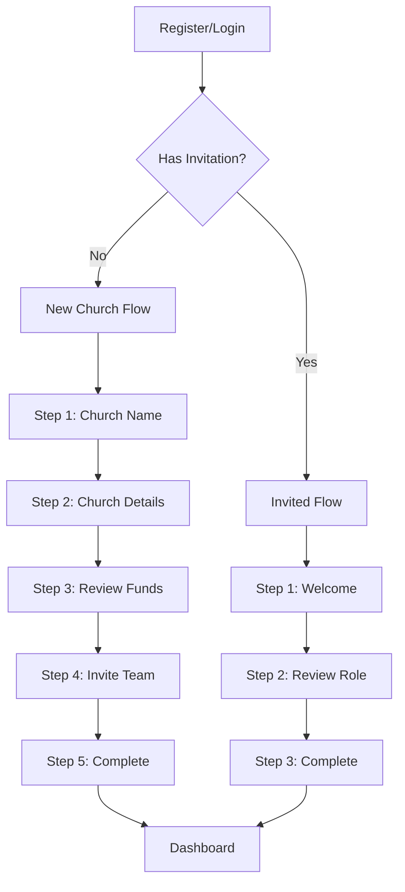
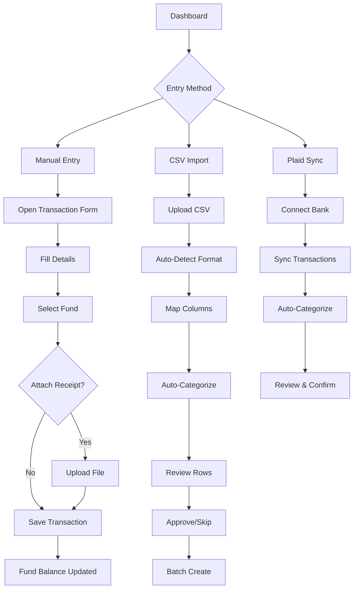
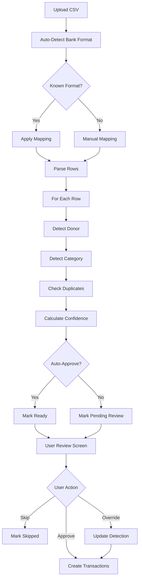
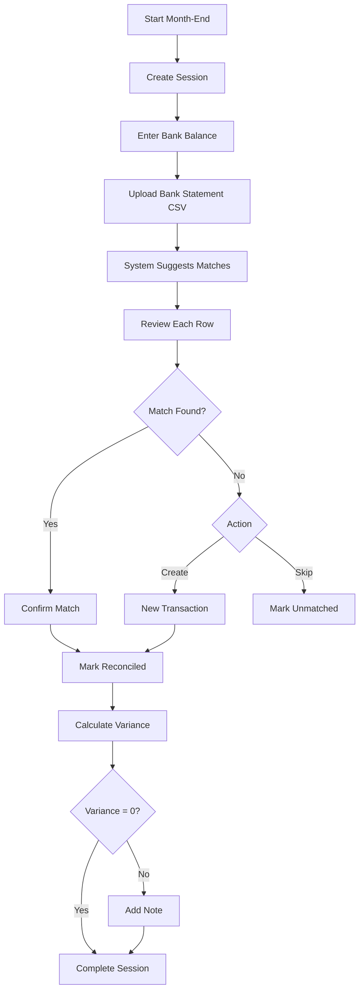
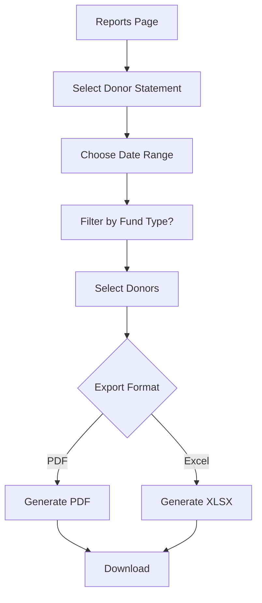
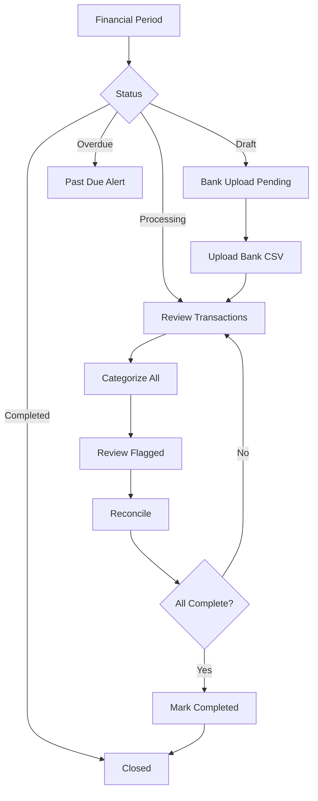

# ChurchCoin Application Documentation
## Complete Reference for Deployed Features, Workflows, Charts & Business Logic

**Version**: Current Production
**Last Updated**: December 2024

---

## Table of Contents

1. [Executive Summary](#1-executive-summary)
2. [Application Architecture](#2-application-architecture)
3. [User Workflows](#3-user-workflows)
4. [Feature Documentation](#4-feature-documentation)
5. [Charts & Visualizations](#5-charts--visualizations)
6. [Business Logic & Data Flows](#6-business-logic--data-flows)
7. [Database Schema](#7-database-schema)
8. [API Reference](#8-api-reference)

---

## 1. Executive Summary

ChurchCoin is an AI-first financial management platform designed for small and medium UK churches, helping them manage funds, track donations, and maintain compliance with charity regulations. The application provides:

- **Fund Accounting**: General, Restricted, and Designated fund management
- **Transaction Processing**: Manual entry, CSV import, and Plaid bank integration
- **Donor Management**: Gift Aid tracking, donor statements, giving history
- **Bank Reconciliation**: Month-end reconciliation workflows
- **AI-Powered Features**: Auto-categorization, insights, and anomaly detection
- **Compliance**: UK charity regulations, Gift Aid calculations, audit trails
- **Multi-Tenancy**: Complete church isolation with role-based access

### Technology Stack

| Layer | Technology |
|-------|------------|
| Frontend | Next.js 15.5, React 19, TypeScript |
| UI Framework | shadcn/ui, Tailwind CSS, Framer Motion |
| Charts | Recharts |
| Backend | Convex (serverless database & functions) |
| Authentication | Clerk |
| Bank Integration | Plaid |
| AI | Gemini API |

---

## 2. Application Architecture

### 2.1 Route Structure

```
/ (Landing Page)
├── /login                    # Clerk authentication
├── /register                 # User registration
├── /onboarding              # Onboarding router
│   ├── /invited             # Invited user flow (3 steps)
│   └── /new-church          # New church setup (5 steps)
│
└── /(dashboard)             # Protected dashboard routes
    ├── /dashboard           # Main financial dashboard
    ├── /funds               # Fund management
    │   └── /[id]           # Individual fund detail
    ├── /transactions        # Transaction ledger
    ├── /donors              # Donor directory
    │   └── /import         # Bulk donor import
    ├── /imports             # CSV bank import
    ├── /reconciliation      # Bank reconciliation
    ├── /reports             # Financial reporting
    └── /settings            # Church settings
        ├── /team           # Team management tab
        ├── /automation     # AI settings tab
        └── /bank-accounts  # Plaid connections tab
```

### 2.2 Component Architecture

```
src/
├── app/                          # Next.js App Router
│   ├── (dashboard)/             # Dashboard layout group
│   │   ├── layout.tsx           # Sidebar + header
│   │   └── [page]/page.tsx      # Individual pages
│   └── providers/               # React context providers
│
├── components/
│   ├── ui/                      # shadcn/ui base components
│   ├── navigation/              # Sidebar, header, mobile nav
│   ├── dashboard/               # KPI cards, metrics
│   ├── funds/                   # Fund cards, forms
│   ├── transactions/            # Ledger, sparklines
│   ├── donors/                  # Donor cards, forms
│   ├── reports/                 # Chart components
│   └── ai/                      # Insights widget
│
└── lib/                         # Utilities
```

### 2.3 Backend Architecture (Convex)

```
convex/
├── schema.ts                    # Database schema (18 tables)
├── lib/
│   ├── auth.ts                  # Authentication middleware
│   ├── balances.ts              # Balance calculations
│   ├── permissions.ts           # Role-based access
│   ├── periods.ts               # Financial period helpers
│   └── fundOverview.ts          # Fund aggregation
│
├── [domain].ts                  # Domain functions
│   ├── funds.ts
│   ├── transactions.ts
│   ├── donors.ts
│   ├── categories.ts
│   ├── churches.ts
│   ├── imports.ts
│   ├── reconciliation.ts
│   ├── reports.ts
│   ├── financialPeriods.ts
│   ├── plaid.ts / plaidInternal.ts
│   ├── ai.ts / aiInsights.ts
│   ├── auth.ts
│   └── onboarding.ts
```

---

## 3. User Workflows

### 3.1 Onboarding Flow

#### New Church Setup (5 Steps)



**Step 1 - Church Name**
- Input: Church/organization name
- Validation: Required, 2-100 characters

**Step 2 - Church Details**
- Charity registration number (optional)
- Address (optional)
- Fiscal year end month (default: December)
- Gift Aid enabled toggle

**Step 3 - Review Funds**
- Pre-created funds displayed:
  - General Fund (general type)
  - Building Fund (designated type)
- Option to customize names

**Step 4 - Invite Team**
- Email input with role selection
- Roles: Admin, Treasurer, Bookkeeper, Viewer
- Sends invitation email with 14-day token

**Step 5 - Complete**
- Summary of setup
- Default categories seeded
- Redirect to dashboard

#### Invited User Flow (3 Steps)

**Step 1 - Welcome**
- Display church name
- Display assigned role

**Step 2 - Review Role**
- Explain role permissions
- Accept invitation

**Step 3 - Complete**
- Link account to church
- Redirect to dashboard

---

### 3.2 Daily Transaction Entry Workflow



**Manual Entry Fields**:
| Field | Required | Description |
|-------|----------|-------------|
| Date | Yes | Transaction date |
| Description | Yes | Transaction description |
| Amount | Yes | Positive number |
| Type | Yes | Income or Expense |
| Fund | Yes | Target fund |
| Category | No | For reporting |
| Donor | No | For income only |
| Payment Method | No | Cash, Transfer, etc. |
| Reference | No | Bank reference |
| Gift Aid | No | Eligible for Gift Aid |
| Notes | No | Internal notes |
| Receipt | No | File attachment |

---

### 3.3 CSV Import Workflow



**Supported Bank Formats**:
- Barclays
- HSBC
- Metro Bank
- Generic CSV

**Auto-Detection Logic**:
1. **Donor Matching**:
   - Exact bank reference match (confidence 1.0)
   - Fuzzy name match in description (threshold 0.3)

2. **Category Detection**:
   - Keyword phrase match (confidence 10)
   - Word boundary match (confidence 5)
   - AI suggestion if enabled

3. **Duplicate Detection**:
   - Same date + amount (±£0.01) + reference

---

### 3.4 Bank Reconciliation Workflow



**Session Status Flow**:
```
open → in-progress → completed
```

**Variance Calculation**:
```
Variance = Bank Balance - Ledger Balance - Pending Transactions
```

---

### 3.5 Donor Statement Generation Workflow



**Statement Contents**:
- Donor name and address
- Date range
- Transaction list (date, description, amount, fund)
- Total giving
- Gift Aid eligible amount
- Gift Aid value (25% of eligible)
- For restricted funds: pledge tracking

---

### 3.6 Period Close Workflow



**Period Auto-Completion Rules**:
- All transactions categorized
- All flagged transactions reviewed
- Reconciliation completed
- Auto-completes if criteria met

---

## 4. Feature Documentation

### 4.1 Fund Management

#### Fund Types

| Type | Purpose | Restrictions |
|------|---------|--------------|
| **General** | Operational/core funds | None - can be used freely |
| **Restricted** | Legally restricted purposes | Must be used for stated purpose |
| **Designated** | Board-designated purposes | Can be repurposed by decision |

#### Fund Operations

**Create Fund**
- Name (required)
- Type (required: general/restricted/designated)
- Description (optional)
- Restrictions (for restricted funds)
- Fundraising toggle
- Fundraising target (if fundraising)

**Fund Balance Calculation**
```
Balance = Σ(Income Transactions) - Σ(Expense Transactions)
```

**Fundraising Features**
- Target amount setting
- Progress tracking
- Pledge management
- Raised vs. Pledged vs. Outstanding display

#### Fund Detail Page Tabs

1. **Overview Tab**
   - Current balance
   - Fund type badge
   - Description & restrictions
   - Progress (if fundraising)

2. **Ledger Tab**
   - All transactions for this fund
   - Running balance display
   - Filter and search

3. **Fundraising Tab** (if fundraising enabled)
   - Progress chart
   - Pledge list
   - Donor contributions

4. **Settings Tab**
   - Edit fund details
   - Archive fund option

---

### 4.2 Transaction Management

#### Transaction Fields

| Field | Type | Required | Description |
|-------|------|----------|-------------|
| date | string | Yes | ISO date (YYYY-MM-DD) |
| description | string | Yes | Transaction description |
| amount | number | Yes | Positive amount |
| type | enum | Yes | income / expense |
| fundId | ID | Yes | Target fund |
| categoryId | ID | No | Category for reporting |
| donorId | ID | No | Donor (income only) |
| method | string | No | Payment method |
| reference | string | No | Bank reference |
| giftAid | boolean | No | Gift Aid eligible |
| reconciled | boolean | No | Bank reconciled |
| pendingStatus | enum | No | none / pending / cleared |
| source | enum | Yes | manual / csv / api / plaid |
| notes | string | No | Internal notes |
| receiptStorageId | ID | No | Attached receipt |

#### Transaction Sources

1. **Manual Entry** (source: manual)
   - User enters via form
   - Immediate fund balance update

2. **CSV Import** (source: csv)
   - Batch import from bank file
   - Auto-categorization
   - Duplicate detection

3. **Plaid Sync** (source: plaid)
   - Automatic from connected bank
   - Uses plaidTransactionId for dedup
   - Pending transaction handling

#### Pending Transaction States

```
none → pending → cleared
```

- **None**: Normal transaction, cleared
- **Pending**: Awaiting bank clearance (e.g., check)
- **Cleared**: Bank has processed

---

### 4.3 Donor Management

#### Donor Fields

| Field | Type | Required | Description |
|-------|------|----------|-------------|
| name | string | Yes | Donor name |
| email | string | No | Email address |
| phone | string | No | Phone number |
| address | string | No | Mailing address |
| bankReference | string | No | Bank payment reference |
| giftAidDeclaration | object | No | Gift Aid declaration |
| notes | string | No | Internal notes |
| isActive | boolean | Yes | Soft delete flag |

#### Gift Aid Declaration Object

```typescript
{
  signed: boolean,      // Has signed declaration
  date: string,         // Declaration date (ISO)
  expiryDate?: string   // When declaration expires
}
```

#### Donor Metrics

| Metric | Calculation |
|--------|-------------|
| Total Giving | Sum of all income transactions |
| Gift Count | Count of income transactions |
| Average Gift | Total Giving / Gift Count |
| Last Gift Date | Most recent transaction date |
| Gift Aid Eligible | Sum where giftAid = true |
| Gift Aid Value | Eligible × 0.25 |

#### Donor Status

| Status | Definition |
|--------|------------|
| Active | Gave within last 12 months |
| Lapsed | No gifts in 12+ months |
| New | First gift within last 90 days |

---

### 4.4 Reporting

#### Available Reports

1. **Income/Expense Report**
   - Date range selection
   - Bar chart visualization
   - Category breakdown
   - Fund breakdown

2. **Fund Balance Report**
   - Snapshot of all fund balances
   - Type breakdown (General/Restricted/Designated)
   - Balance allocation chart

3. **Donor Statements**
   - Individual or batch generation
   - Date range filtering
   - Fund type filtering
   - PDF/Excel export

4. **Gift Aid Report**
   - Eligible transactions
   - Claim calculation (25%)
   - By-donor breakdown
   - Declaration status

5. **Reconciliation Report**
   - Session history
   - Variance tracking
   - Match quality metrics

#### Export Formats

- **PDF**: Formatted report with charts
- **Excel**: Raw data with formulas
- **CSV**: Simple data export

---

### 4.5 AI Features

#### Auto-Categorization

**Priority Order**:
1. Learned feedback (confidence 1.0)
2. Cached AI result
3. Keyword matching
4. AI API call (DeepSeek)

**Keyword Matching**:
```
Exact phrase match: confidence 10
Word boundary match: confidence 5
Partial match: lower confidence
```

**AI Request**:
```typescript
// Input to AI
{
  description: "Direct Debit - BUILDING SOCIETY",
  amount: 150.00,
  categories: [
    { id: "123", name: "Mortgage Payment", type: "expense" },
    { id: "456", name: "Utilities", type: "expense" },
    // ...
  ]
}

// AI Response
{
  categoryId: "123",
  confidence: 0.85,
  reason: "Building society payments are typically mortgage related"
}
```

**Cost Tracking**:
- Input: £0.44 per 1M tokens
- Output: £1.75 per 1M tokens
- Cached for 7 days

#### AI Insights

**Insight Types**:
| Type | Description |
|------|-------------|
| anomaly | Unusual transaction pattern |
| trend | Balance or giving trend |
| compliance | Gift Aid expiry, missing declarations |
| prediction | Forecasts based on history |
| recommendation | Suggested actions |

**Severity Levels**:
- `info`: Informational only
- `warning`: Needs attention
- `critical`: Requires immediate action

---

### 4.6 Plaid Bank Integration

#### Connection Flow

1. **Generate Link Token**
   ```
   POST /plaid/link/token/create
   → {link_token, expiration}
   ```

2. **User Completes Plaid Link**
   - Opens Plaid Link UI
   - User authenticates with bank
   - Returns public_token

3. **Exchange Token**
   ```
   POST /plaid/item/public_token/exchange
   → {access_token, item_id}
   ```

4. **Store Connection**
   - Save access_token (encrypted)
   - Store account details
   - Initialize sync cursor

#### Transaction Sync

**Sync Mechanism**: Cursor-based incremental sync

```typescript
// Request
POST /plaid/transactions/sync
{
  access_token: "...",
  cursor: "last_cursor_value" // or null for full sync
}

// Response
{
  added: Transaction[],
  modified: Transaction[],
  removed: { transaction_id: string }[],
  next_cursor: "new_cursor_value",
  has_more: boolean
}
```

**Deduplication**: Uses `plaidTransactionId` to prevent duplicates

---

### 4.7 Role-Based Access Control

#### Roles & Permissions

| Permission | Admin | Treasurer | Bookkeeper | Viewer |
|------------|-------|-----------|------------|--------|
| Create Transaction | ✓ | ✓ | ✓ | ✗ |
| Edit Transaction | ✓ | ✓ | ✗ | ✗ |
| Delete Transaction | ✓ | ✗ | ✗ | ✗ |
| Create/Edit Fund | ✓ | ✓ | ✗ | ✗ |
| Delete Fund | ✓ | ✗ | ✗ | ✗ |
| Manage Donors | ✓ | ✓ | ✗ | ✗ |
| View Reports | ✓ | ✓ | ✓ | ✓ |
| Reconciliation | ✓ | ✓ | ✗ | ✗ |
| Manage Bank Connections | ✓ | ✗ | ✗ | ✗ |
| Manage Team | ✓ | ✗ | ✗ | ✗ |
| Church Settings | ✓ | ✗ | ✗ | ✗ |

---

## 5. Charts & Visualizations

### 5.1 Chart Library

**Primary Library**: Recharts v2.13.3

**Components Used**:
- AreaChart (sparklines)
- BarChart (income/expense comparisons)
- LineChart (trends)
- PieChart (distributions)

### 5.2 Dashboard Charts

#### 5.2.1 Hero Metric Cards

**Location**: `/src/components/dashboard/hero-metric-card.tsx`

**Display**: 4 cards in grid
- General Fund Balance
- Total Income (YTD)
- Active Donors
- Critical Issues

**Features**:
- Large value with currency formatting
- Trend indicator (up/down/flat arrow)
- Status badge (healthy/warning/critical)
- Animated value changes (Framer Motion)

#### 5.2.2 Income vs Expense Chart (12 months)

**Location**: Dashboard page

**Type**: Recharts BarChart

**Configuration**:
```typescript
{
  height: 256,
  bars: [
    { dataKey: "income", fill: "#6b8e6b" },  // Sage green
    { dataKey: "expense", fill: "#d4a574" }  // Tan
  ],
  grid: { strokeDasharray: "3 3" },
  tooltip: { currency formatted }
}
```

#### 5.2.3 Donor Retention Trend

**Location**: Dashboard - Donor Health section

**Type**: Recharts LineChart

**Configuration**:
```typescript
{
  height: 60,
  line: { stroke: "#6b8e6b", strokeWidth: 2 },
  domain: [0, 100],  // Percentage
  dots: true
}
```

#### 5.2.4 Fund Balance Progress Bars

**Location**: Dashboard - Financial Details section

**Type**: Custom progress bar component

**Features**:
- Horizontal bar showing % of total
- Important funds (≥£5,000) marked with ⭐
- Fund name and amount labels

#### 5.2.5 KPI Sparklines

**Location**: `/src/components/dashboard/kpi-card.tsx`

**Type**: Recharts AreaChart (small)

**Configuration**:
```typescript
{
  width: 100,
  height: 40,
  area: { fill: "currentColor", opacity: 0.2 },
  line: { stroke: "currentColor" }
}
```

### 5.3 Reports Page Charts

#### 5.3.1 Income vs Expenditure Bar Chart

**Type**: Recharts BarChart

**Configuration**:
```typescript
{
  height: 320,
  bars: [
    { dataKey: "income", fill: "#0A5F38" },     // Success green
    { dataKey: "expenditure", fill: "#8B0000" } // Error red
  ],
  legend: true
}
```

#### 5.3.2 Income Distribution Pie Chart

**Type**: Recharts PieChart (Donut)

**Configuration**:
```typescript
{
  height: 320,
  innerRadius: 60,
  outerRadius: 100,
  colors: [
    "#0A5F38", "#6b8e6b", "#8B4513",
    "#d4a574", "#4A4A4A", "#E8E8E6"
  ],
  labels: { percentage }
}
```

#### 5.3.3 Expense Breakdown Bar Chart

**Type**: Recharts BarChart (Vertical)

**Configuration**:
```typescript
{
  height: 320,
  xAxis: { angle: -20 },  // Rotated labels
  bar: { fill: "#8B0000" }
}
```

#### 5.3.4 Weekly Giving Trend Line Chart

**Type**: Recharts LineChart

**Configuration**:
```typescript
{
  height: 320,
  lines: [
    { dataKey: "general", stroke: "#0A5F38", name: "General" },
    { dataKey: "restricted", stroke: "#8B0000", name: "Restricted" },
    { dataKey: "total", stroke: "#000000", name: "Total" }
  ],
  legend: true,
  tooltip: { currency formatted }
}
```

### 5.4 Custom Visualizations

#### 5.4.1 Trend Sparkline

**Location**: `/src/components/transactions/trend-sparkline.tsx`

**Type**: Custom SVG path

**Features**:
- Lightweight (no chart library)
- Configurable width, height, color
- Smooth curve interpolation

#### 5.4.2 Fundraising Progress

**Location**: `/src/components/funds/fundraising-progress.tsx`

**Features**:
- Animated progress bar
- Three metric cards (Raised, Pledged, Outstanding)
- Percentage display
- Color-coded based on progress

#### 5.4.3 Budget Variance Progress

**Location**: Reports page (inline)

**Features**:
- Progress bar in table cell
- Green for under budget
- Red for over budget
- Percentage label

### 5.5 Design System Colors

| Usage | Color | Hex |
|-------|-------|-----|
| Success/Income | Sage Green | #0A5F38 |
| Secondary Green | Sage Light | #6b8e6b |
| Error/Expense | Dark Red | #8B0000 |
| Warning | Tan | #d4a574 |
| Neutral | Ink Black | #000000 |
| Grid Lines | Ledger Gray | #E8E8E6 |
| Background | Paper | #FAFAF8 |
| Text Secondary | Grey Mid | #6B6B6B |

---

## 6. Business Logic & Data Flows

### 6.1 Fund Balance Calculation

**Source of Truth**: Transactions table

```typescript
function calculateFundBalance(fundId: Id<"funds">) {
  const transactions = db.query("transactions")
    .withIndex("by_fund", q => q.eq("fundId", fundId))
    .collect();

  return transactions.reduce((balance, tx) => {
    return tx.type === "income"
      ? balance + tx.amount
      : balance - tx.amount;
  }, 0);
}
```

**Balance Update on Transaction Create**:
```typescript
// After inserting transaction
if (type === "income") {
  fund.balance += amount;
} else {
  fund.balance -= amount;
}
```

**Balance Update on Transaction Delete**:
```typescript
// Before deleting transaction
if (type === "income") {
  fund.balance -= amount;
} else {
  fund.balance += amount;
}
```

**Balance Update on Transaction Update** (when amount/type/fund changes):
```typescript
// Reverse old impact
if (oldType === "income") {
  oldFund.balance -= oldAmount;
} else {
  oldFund.balance += oldAmount;
}

// Apply new impact
if (newType === "income") {
  newFund.balance += newAmount;
} else {
  newFund.balance -= newAmount;
}
```

### 6.2 Period Calculation

**Month-in-Arrears Logic**: Dashboard for October shows September data

```typescript
function calculatePeriodFields(transactionDate: string) {
  const date = new Date(transactionDate);
  return {
    periodMonth: date.getMonth() + 1,  // 1-12
    periodYear: date.getFullYear(),
    weekEnding: calculateWeekEndingSunday(date)
  };
}
```

**Week Ending Calculation**:
```typescript
function calculateWeekEndingSunday(date: Date): string {
  const dayOfWeek = date.getDay();
  const daysToSunday = dayOfWeek === 0 ? 0 : 7 - dayOfWeek;
  const sunday = new Date(date);
  sunday.setDate(date.getDate() + daysToSunday);
  return formatDate(sunday, "DD/MM/YYYY");
}
```

### 6.3 Gift Aid Calculation

**Gift Aid Value**: 25% of eligible donations

```typescript
function calculateGiftAidClaim(churchId: Id<"churches">, startDate: string, endDate: string) {
  const transactions = db.query("transactions")
    .withIndex("by_church_date", q =>
      q.eq("churchId", churchId)
       .gte("date", startDate)
       .lte("date", endDate))
    .filter(q => q.eq(q.field("type"), "income"))
    .filter(q => q.eq(q.field("giftAid"), true))
    .collect();

  const eligibleAmount = transactions.reduce((sum, tx) => sum + tx.amount, 0);
  const giftAidValue = eligibleAmount * 0.25;

  return {
    eligibleAmount,
    giftAidValue,
    transactionCount: transactions.length
  };
}
```

### 6.4 Duplicate Detection

**CSV Import Duplicate Check**:
```typescript
function findDuplicates(churchId: Id<"churches">, date: string, amount: number, reference?: string) {
  const candidates = db.query("transactions")
    .withIndex("by_church_date", q => q.eq("churchId", churchId).eq("date", date))
    .collect();

  return candidates.filter(tx => {
    // Amount match within £0.01 tolerance
    const amountMatch = Math.abs(tx.amount - amount) <= 0.01;

    // Reference match (if both have references)
    const referenceMatch = reference && tx.reference
      ? tx.reference.toLowerCase().includes(reference.toLowerCase())
      : true;

    return amountMatch && referenceMatch;
  });
}
```

**Plaid Transaction Dedup**:
```typescript
// Uses unique plaidTransactionId
const existing = db.query("transactions")
  .withIndex("by_plaid_transaction", q => q.eq("plaidTransactionId", plaidTxId))
  .unique();

if (existing) {
  // Update instead of create
}
```

### 6.5 AI Categorization Flow

```typescript
async function suggestCategory(churchId: Id<"churches">, description: string, amount: number) {
  // 1. Check feedback (learned corrections)
  const feedback = db.query("aiFeedback")
    .withIndex("by_church_input", q =>
      q.eq("churchId", churchId)
       .eq("inputHash", hash(churchId, description, amount)))
    .first();

  if (feedback) {
    return {
      categoryId: feedback.chosenCategoryId,
      confidence: 1.0,
      source: "feedback"
    };
  }

  // 2. Check cache
  const cached = db.query("aiCache")
    .withIndex("by_key", q => q.eq("key", cacheKey))
    .first();

  if (cached && cached.expiresAt > Date.now()) {
    return JSON.parse(cached.value);
  }

  // 3. Try keyword matching
  const keywords = db.query("categoryKeywords")
    .withIndex("by_church", q => q.eq("churchId", churchId))
    .collect();

  const keywordMatch = findBestKeywordMatch(description, keywords);
  if (keywordMatch.confidence >= 5) {
    return {
      categoryId: keywordMatch.categoryId,
      confidence: keywordMatch.confidence / 10,
      source: "keyword"
    };
  }

  // 4. Call AI API
  const aiResult = await callDeepSeekAPI(description, amount, categories);

  // Cache result for 7 days
  await db.insert("aiCache", {
    key: cacheKey,
    value: JSON.stringify(aiResult),
    expiresAt: Date.now() + 7 * 24 * 60 * 60 * 1000
  });

  return aiResult;
}
```

### 6.6 Reconciliation Variance

```typescript
function calculateVariance(session: ReconciliationSession) {
  // Get all unreconciled transactions
  const unreconciled = db.query("transactions")
    .withIndex("by_church_date", q =>
      q.eq("churchId", session.churchId)
       .lte("date", session.periodEnd))
    .filter(q => q.eq(q.field("reconciled"), false))
    .collect();

  // Calculate pending impact
  const pendingTotal = unreconciled
    .filter(tx => tx.pendingStatus === "pending")
    .reduce((sum, tx) => {
      return sum + (tx.type === "income" ? tx.amount : -tx.amount);
    }, 0);

  // Calculate variance
  const variance = session.bankBalance - session.ledgerBalance - pendingTotal;

  return {
    variance,
    pendingTotal,
    unreconciledCount: unreconciled.length
  };
}
```

---

## 7. Database Schema

### 7.1 Core Tables

#### churches
```typescript
{
  _id: Id<"churches">,
  name: string,
  charityNumber?: string,
  address?: string,
  settings: {
    fiscalYearEnd: string,           // "December"
    giftAidEnabled: boolean,
    defaultCurrency: string,         // "GBP"
    defaultFundId?: Id<"funds">,
    autoApproveThreshold?: number,   // 0-1, default 0.95
    enableAiCategorization?: boolean,
    importsAllowAi?: boolean,
    aiApiKey?: string,               // DeepSeek API key
    plaidDefaultFundId?: Id<"funds">
  }
}
```

#### users
```typescript
{
  _id: Id<"users">,
  name: string,
  email: string,
  emailVerified?: number,
  image?: string,
  phone?: string,
  churchId?: Id<"churches">,
  role: "admin" | "finance" | "pastorate" | "secured_guest",
  clerkUserId?: string,
  onboardingStatus: "pending" | "in_progress" | "completed",
  onboardingCompletedAt?: number
}
// Indexes: by_email, by_church, by_clerk_user
```

#### funds
```typescript
{
  _id: Id<"funds">,
  churchId: Id<"churches">,
  name: string,
  type: "general" | "restricted" | "designated",
  balance: number,
  description?: string,
  restrictions?: string,
  isFundraising: boolean,
  fundraisingTarget?: number,
  isActive: boolean
}
// Indexes: by_church, by_type
```

#### transactions
```typescript
{
  _id: Id<"transactions">,
  churchId: Id<"churches">,
  date: string,                      // ISO date
  description: string,
  amount: number,
  type: "income" | "expense",
  fundId: Id<"funds">,
  categoryId?: Id<"categories">,
  donorId?: Id<"donors">,
  method?: string,
  reference?: string,
  giftAid: boolean,
  reconciled: boolean,
  notes?: string,
  createdBy: Id<"users">,
  source: "manual" | "csv" | "api" | "plaid",
  receiptStorageId?: Id<"_storage">,
  pendingStatus?: "none" | "pending" | "cleared",
  plaidTransactionId?: string,
  plaidItemId?: Id<"plaidItems">,
  periodMonth?: number,
  periodYear?: number,
  weekEnding?: string,
  needsReview?: boolean
}
// Indexes: by_church_date, by_fund, by_donor, by_category, by_reconciled,
//          by_period, by_plaid_transaction, by_plaid_item
```

#### donors
```typescript
{
  _id: Id<"donors">,
  churchId: Id<"churches">,
  name: string,
  email?: string,
  phone?: string,
  address?: string,
  bankReference?: string,
  giftAidDeclaration?: {
    signed: boolean,
    date: string,
    expiryDate?: string
  },
  notes?: string,
  isActive: boolean
}
// Indexes: by_church, by_email, by_reference
```

#### categories
```typescript
{
  _id: Id<"categories">,
  churchId: Id<"churches">,
  name: string,
  type: "income" | "expense",
  parentId?: Id<"categories">,
  isSubcategory: boolean,
  isSystem: boolean
}
// Indexes: by_church, by_type, by_subcategory
```

### 7.2 Import & Reconciliation Tables

#### csvImports
```typescript
{
  _id: Id<"csvImports">,
  churchId: Id<"churches">,
  filename: string,
  uploadedAt: number,
  bankFormat: "barclays" | "hsbc" | "metrobank" | "generic",
  status: "uploaded" | "mapping" | "processing" | "completed" | "failed",
  rowCount: number,
  processedCount: number,
  duplicateCount: number,
  mapping: {
    date: string,
    description: string,
    amount: string,
    amountIn?: string,
    amountOut?: string,
    reference?: string,
    type?: string
  }
}
```

#### reconciliationSessions
```typescript
{
  _id: Id<"reconciliationSessions">,
  churchId: Id<"churches">,
  startedAt: number,
  month: string,
  status: "open" | "in-progress" | "completed",
  bankBalance: number,
  ledgerBalance: number,
  pendingTotal?: number,
  variance?: number,
  closedAt?: number,
  preparedBy?: Id<"users">,
  notes?: string
}
```

### 7.3 AI & Learning Tables

#### aiCache
```typescript
{
  _id: Id<"aiCache">,
  key: string,           // hash(churchId, description, amount)
  value: string,         // JSON stringified suggestion
  model: string,         // "deepseek-chat"
  expiresAt: number,     // TTL: 7 days
  churchId?: Id<"churches">
}
// Index: by_key
```

#### aiFeedback
```typescript
{
  _id: Id<"aiFeedback">,
  churchId: Id<"churches">,
  inputHash: string,
  description: string,
  amount: number,
  chosenCategoryId: Id<"categories">,
  confidence: number,
  createdAt: number,
  userId?: Id<"users">
}
// Index: by_church_input
```

### 7.4 Bank Integration Tables

#### plaidItems
```typescript
{
  _id: Id<"plaidItems">,
  churchId: Id<"churches">,
  itemId: string,
  accessToken: string,
  institutionId: string,
  institutionName: string,
  accounts: [{
    accountId: string,
    name: string,
    type: string,
    subtype: string,
    mask?: string,
    balances: {
      current?: number,
      available?: number
    }
  }],
  status: "active" | "error" | "login_required" | "disconnected",
  syncCursor?: string,
  lastSyncedAt?: number,
  linkedBy: Id<"users">,
  linkedAt: number
}
// Indexes: by_church, by_item_id, by_status
```

---

## 8. API Reference

### 8.1 Fund Functions

| Function | Type | Args | Returns |
|----------|------|------|---------|
| `getFunds` | Query | churchId, limit? | Fund[] |
| `getFund` | Query | fundId | Fund \| null |
| `getFundsOverview` | Query | churchId | FundOverview[] |
| `createFund` | Mutation | name, type, description?, ... | Id |
| `updateFund` | Mutation | fundId, name?, type?, ... | Id |
| `archiveFund` | Mutation | fundId | void |

### 8.2 Transaction Functions

| Function | Type | Args | Returns |
|----------|------|------|---------|
| `getTransactions` | Query | churchId, fundId?, limit? | Transaction[] |
| `getLedger` | Query | churchId, limit? | EnhancedTransaction[] |
| `getLedgerByPeriod` | Query | churchId, year, month | EnhancedTransaction[] |
| `createTransaction` | Mutation | date, description, amount, type, fundId, ... | Id |
| `updateTransaction` | Mutation | transactionId, date?, amount?, ... | Id |
| `deleteTransaction` | Mutation | transactionId | void |
| `reconcileTransaction` | Mutation | transactionId, reconciled | void |

### 8.3 Donor Functions

| Function | Type | Args | Returns |
|----------|------|------|---------|
| `getDonors` | Query | churchId | Donor[] |
| `getDonor` | Query | donorId | Donor \| null |
| `searchDonors` | Query | churchId, searchTerm | Donor[] |
| `getDonorGivingHistory` | Query | donorId, year? | GivingHistory |
| `createDonor` | Mutation | name, email?, ... | Id |
| `updateDonor` | Mutation | donorId, name?, ... | void |
| `archiveDonor` | Mutation | donorId | void |

### 8.4 Report Functions

| Function | Type | Args | Returns |
|----------|------|------|---------|
| `getFundBalanceSummary` | Query | churchId | BalanceSummary |
| `getIncomeExpenseReport` | Query | churchId, startDate, endDate | Report |
| `getDonorStatementBatch` | Query | churchId, fromDate, toDate, ... | Statement[] |
| `getGiftAidClaimReport` | Query | churchId, startDate, endDate | GiftAidReport |

### 8.5 Import Functions

| Function | Type | Args | Returns |
|----------|------|------|---------|
| `uploadCsvImport` | Mutation | churchId, filename, format, ... | Id |
| `processImportRow` | Mutation | importId, rowIndex, ... | void |
| `approveCsvRows` | Mutation | importId, rowIds[], ... | void |
| `completeCsvImport` | Mutation | importId | void |

### 8.6 Plaid Functions

| Function | Type | Args | Returns |
|----------|------|------|---------|
| `createLinkToken` | Action | churchId, userId | LinkToken |
| `exchangePublicToken` | Action | churchId, publicToken, ... | ItemDetails |
| `getLinkedAccounts` | Query | churchId | PlaidItem[] |
| `syncTransactions` | Action | churchId, plaidItemId, fullSync? | SyncResult |
| `disconnectItem` | Action | churchId, plaidItemId | void |

---

## Appendix A: File Reference

### Frontend Pages
| File | Purpose |
|------|---------|
| `src/app/page.tsx` | Landing page |
| `src/app/(dashboard)/dashboard/page.tsx` | Main dashboard |
| `src/app/(dashboard)/funds/page.tsx` | Fund overview |
| `src/app/(dashboard)/funds/[id]/page.tsx` | Fund detail |
| `src/app/(dashboard)/transactions/page.tsx` | Transaction ledger |
| `src/app/(dashboard)/donors/page.tsx` | Donor directory |
| `src/app/(dashboard)/imports/page.tsx` | CSV import |
| `src/app/(dashboard)/reconciliation/page.tsx` | Bank reconciliation |
| `src/app/(dashboard)/reports/page.tsx` | Reporting |
| `src/app/(dashboard)/settings/page.tsx` | Settings |

### Backend Functions
| File | Purpose |
|------|---------|
| `convex/schema.ts` | Database schema |
| `convex/funds.ts` | Fund CRUD |
| `convex/transactions.ts` | Transaction CRUD |
| `convex/donors.ts` | Donor CRUD |
| `convex/categories.ts` | Category management |
| `convex/churches.ts` | Church settings |
| `convex/imports.ts` | CSV import |
| `convex/reconciliation.ts` | Reconciliation |
| `convex/reports.ts` | Reporting |
| `convex/plaid.ts` | Plaid integration |
| `convex/ai.ts` | AI categorization |
| `convex/auth.ts` | Authentication |

---

*This documentation represents the current deployed state of the ChurchCoin application as of December 2024.*
