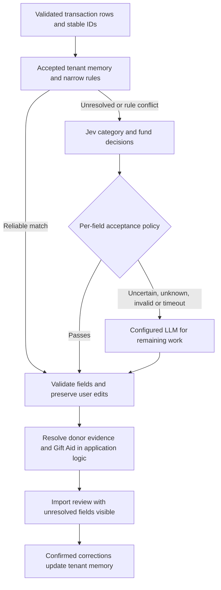

# Jev implementation review and plan

Date: 21 September 2026

Reviewed checkout: `codex/jev`, commit `8ac40d7192be56412fc1851c6f197fc33830fbca`

Latest update: **22 September 2026**, following the Vercel form-router review. Implemented and validated in the working tree; Jev defaults to **off**. No hosted ChurchCoin deployment or tenant rollout was changed.

## Recommendation

Ship the deterministic small-income default and import-correctness fixes. The improved Jev stage now preserves decisions separately for each field and uses shared accounting criteria. In the latest synthetic pipeline comparison it cost **33.3% less** than the Luna baseline, with median batch latency **71.4% lower**, and both scored 100% category/fund accuracy on the reviewed fixture. This supersedes the initial, more expensive all-or-nothing design below. Use an allowlisted assist pilot before broad rollout; keep user review before import.

Faster and cheaper classification is plausible. Better ChurchCoin accuracy remains an experiment, not an established result. Typed output prevents invented answer options; it does not prevent choosing the wrong allowed category.

Use **OpenRouter with `typesafe/jev-1.13`**, as explicitly selected by the user. Implement its separate Decisions API alongside the existing OpenRouter chat adapter. Do not introduce another gateway or upgrade the application's AI SDK just for this experiment.

## Implemented improvements, 22 September

- **Independent acceptance:** retain an accepted category when the fund is unresolved, or an accepted fund when the category is unresolved. The existing category probability >=0.95 and fund probability >=0.98 gates, each with a >=0.20 margin, remain unchanged. Validate confidence metadata separately; none of these numbers are empirical accuracy claims.
- **Selective fallback:** send `requestedFields` and only validated known assignments to the generative provider. The compact OpenRouter/OpenAI schema omits repeated descriptions, evidence and Gift Aid output. Fallback answers cannot overwrite accepted fields. Missing, duplicate, invalid or failed responses preserve useful partial results for review. A requested invalid field remains unresolved rather than invalidating unrelated fields.
- **Shared policy:** `lib/categorizationPolicy.ts` supplies category boundaries, tenant fund descriptions, fund-selection rules and donor criteria to Jev, OpenRouter, OpenAI and Gemini. Rejected Jev choices and probabilities are excluded from the fallback prompt.
- **Known donors:** reuse supplied names and unique full-name matches against the current church's individual donor directory, only after Jev identifies an individual donation and the accounting category supports giving. No fuzzy, first-name-only or ambiguous matching. Directory access respects donor-readable roles; Guest never loads it. Reads are capped at 501 records; above 500, directory matching is skipped to avoid matching against an incomplete set. Names are matched locally, and the directory is never sent to a model. This does not establish Gift Aid eligibility.
- **Smaller state and conditional questions:** omit arithmetic, unnecessary fields and questions for valid existing assignments. Single-row requests are available for evaluation. The measured default remains **10 rows per request**, concurrency four: one-row requests were slower, more expensive and less accurate in the comparison. Each call retains its 1.5-second deadline, with a six-second budget for scheduling Jev work across an action and no automatic retries. A failing wave stops new scheduling while preserving completed results.
- **Provenance and diagnostics:** persist the source of category, fund and donor separately, plus optional per-field model statistics. Count fallback reasons for unknown, uncertain or invalid fields, donor extraction, timeouts, provider errors and unscheduled rows. Operational logs omit bank text and donor names.
- **Evaluation:** `scripts/eval-jev-pipeline.mjs` invokes the production rule/default, Jev, provider and merge helpers. It compares full categorisation work after local rules, rather than just the model stage. No new AI SDK or provider dependency was introduced.

### Repeated pipeline comparison

52 synthetic transactions, three runs per mode (**156 row evaluations per mode**, not 156 independent examples), nine batches per mode, with no learned memories or donor-directory matches. Timings include rule/default processing, Jev, fallback and validation; they exclude Convex/auth/database/network-to-browser and UI latency. Costs are actual OpenRouter response usage. All calls succeeded.

| Final mode | Category / fund / donor accuracy | Cost for 156 rows | Median / p95 batch latency | Generative rows / requested fields |
|---|---|---:|---:|---:|
| Rules/defaults + Luna | 100% / 100% / 100% | $0.01117446 | 7,854 / 12,440 ms | 120 / 360 |
| Rules/defaults + Jev batches + selective Luna | 100% / 100% / 100% | $0.007448828 | 2,245 / 4,388 ms | 46 / 55 |

The batched hybrid reduced measured cost by **33.3%**, median latency by **71.4%**, and generative row volume by **61.7%**. This is a synthetic development evaluation, not evidence of production-wide 100% accuracy or calibrated >=99% precision.

Fixture review: two mission-expense fund labels were initially General Fund. They were corrected to Missions Fund after checking the pre-existing mission-boundary cases and the supplied fund criteria. The first run also exposed donor criteria missing from the shared generative policy; those criteria were added before the final comparison. Consequently this fixture is **reviewed development data**, not an untouched final holdout. The original responses/metrics are retained in `jev-pipeline-v3-2026-09-22.json`; final results are in `jev-pipeline-v3-final-2026-09-22.json`, both under the ignored `evals/categorization/results/` directory.

The earlier one-row comparison used the same initial fixture/policy as its batched and Luna comparators: single-row Jev cost $0.00785051 versus $0.006466858 for batching, median 3,470 versus 2,538 ms, with lower joint accuracy. Batching therefore remains the implementation default. Raw results are retained; do not combine those figures with the final revised-policy comparison as if they were the same experiment.

```powershell
node scripts/eval-jev-pipeline.mjs --dry-run
node scripts/eval-jev-pipeline.mjs --modes luna,jev-batch --runs 3
# Optional comparison of request shapes:
node scripts/eval-jev-pipeline.mjs --modes luna,jev-single,jev-batch --runs 3
```

Provide `OPENROUTER_API_KEY` in the evaluator process environment. The scripts never change hosted flags. The live Convex smoke test used an isolated local deployment: a known donor matched locally, a new donor used a donor-only Luna call while retaining the accepted fund, and an unclassified GBP30 receipt used Offerings / General Fund without AI. Temporary local credentials and flags were restored afterwards.

Validation: 335 tests across 44 files, TypeScript validation in the isolated application snapshot, production build, lint (28 existing warnings), and a successful local Convex schema/function push. The tests cover partial outputs, type/tenant validation, field preservation, missing/duplicate rows, donor ambiguity, bounded donor reads, Guest access, provider failures and the authenticated preview action. No hosted production deployment or broad rollout was performed.

Follow-up rollout: use a selected church's `assist` allowlist, review corrections and fallback reasons, and measure a separate representative dataset that was not used to alter prompts or labels. Keep `off` as rollback. The GBP30 rule remains independent of Jev.

Sources informing the iteration: [Vercel form-router guide](https://vercel.com/kb/guide/jev-ai-sdk-form-router), [reference router](https://github.com/vercel-labs/jev-ai-sdk-form-router/blob/main/lib/router.ts), [TypeSafe state semantics](https://docs.typesafe.ai/concepts/state), [confidence guidance](https://docs.typesafe.ai/confidence).

## Implemented: income of £30 or less

The user's additional requirement is implemented across CSV review, bank-sync review, the categorisation pipeline and the server's `bulkCreate` mutation.

| Incoming row | Result |
|---|---|
| Income from £0.01 through £30 inclusive, missing/invalid category | Set the canonical **Offerings** category |
| Same income range, missing/deleted/invalid fund | Set the current tenant's **General Fund** |
| One valid field and one missing/invalid field | Preserve the valid field and default only the other |
| Valid category and valid fund | Preserve both |
| Expenditure or income above £30 | Require valid assignments; this default does not apply |
| General Fund does not exist | Leave the fund unresolved and require selection; never use the first fund |
| Fund belongs to another tenant | Server rejects it; the default does not bypass ownership checks |

The default does not establish Gift Aid eligibility or create/link a donor. Existing manual donor/Gift Aid choices survive categorisation. Applying the default in CSV/bank review avoids model work for those completed rows. In the standalone categorisation pipeline, accepted memory and specific deterministic matches retain precedence over the fallback default. Legacy untyped seed categories are interpreted consistently with the server's category backfill.

Implementation: `lib/smallIncomeDefaults.ts`, `components/TransactionManager.tsx`, `convex/intelligence/categorization/pipeline.ts`, and `convex/mutations/transactions.ts`. The server resolves General Fund once per import when needed, and RAG indexing receives the saved canonical category and resolved fund ID. This changes new imports; it does not rewrite previously saved ledger entries.

## Initial implementation, 21 September: Jev and import integrity

- Added the OpenRouter Decisions adapter for `typesafe/jev-1.13`, using `OPENROUTER_API_KEY` on the server. No new gateway or AI SDK dependency is required.
- Shared question construction and response validation between the backend and evaluator in `lib/jevDecisions.ts`. Category choices respect transaction type; fund choices come from the current tenant. Unknown, malformed and missing decisions go to fallback.
- Starts with batches of 10, up to four simultaneous requests, and a 1.5-second timeout. One failing wave stops further Jev scheduling in that action; healthy batch results survive. There is no automatic Jev retry or persistent cross-action circuit breaker in this version.
- Category probability ≥0.95, fund probability ≥0.98 and margin ≥0.20 are initial routing gates. Named/uncertain individual donors still require generative extraction unless an existing donor name is supplied. These probabilities are not calibrated accuracy claims.
- `off`, `shadow` and `assist` modes require an explicit tenant allowlist. Shadow comparison is scheduled separately and does not change returned suggestions. Assist still requires review and confirmation before saving.
- Jev source, resolved model version, request ID, question-template version, per-field probabilities and Jev confidence flow into suggestion/correction metadata. Rule and Jev sources are accepted by feedback/statistics. Full distributions are retained only in synthetic evaluation output; general operational logs omit bank text.
- Every production categorisation request/result has a stable row ID. Duplicate descriptions, reordered responses, missing results, removed rows, edits during inference and cancellation no longer depend on array positions. Imports request two batches of 20 at a time and show completed batch suggestions progressively.
- Narrowed generic offerings and utilities rules so explicit gender/mission/building purposes and Manse utility costs reach the decision stage. On the same local rule diagnostic below, matches changed from 23 to 19, with **zero category or fund mismatches** among those 19. This is a small synthetic diagnostic, not a population accuracy estimate.

Optional metadata and source-union changes are additive. Existing generative provider configuration remains the fallback selector. In the configured development backend, `CATEGORIZATION_AI_PROVIDER` was verified as `openrouter`; its model override was absent, so the code's Luna default applies. Production configuration was not inspected.

## Measured OpenRouter comparison, 21 September 2026

Ran `evals/categorization/focused-cases.json` (100 synthetic cases including its base fixture), one run per mode, batches of 10. These are **model-stage comparisons**, without memory, deterministic rules or the small-income default. Latency is per serial evaluator batch, not an entire import or the UI's concurrent completion time.

Template v1's smoke test exposed ambiguous General Fund criteria. Template v2 explicitly covers unrestricted tithes, offerings, thanksgiving and ordinary expenses. The first 10 cases were used to refine that prompt, so this dataset is a development evaluation, not an untouched holdout. The returned model version observed in the local action was `typesafe/jev-1.13-20260917`.

| Mode | Category | Fund | Joint category + fund | All fields* | Median / p95 batch latency | Billed cost / 100 rows |
|---|---:|---:|---:|---:|---:|---:|
| OpenRouter Luna alone | 100% | 100% | 100% | 99% | 3,461 / 7,961 ms | $0.00786160 |
| Jev alone | 90% | 85% | 85% | 69%* | 319 / 504 ms | $0.00345778 |
| Jev + Luna fallback/extraction | 99% | 100% | 99% | 98% | 3,202 / 18,909 ms | $0.00986078 |

*All-fields scoring includes donor extraction and the fixture's synthetic `[GA]` convention. Jev alone cannot extract arbitrary names; its all-fields score is not equivalent to a complete solution. Production does not grant Gift Aid from this marker or a model suggestion. Unknown/rejected rows count as missing and incorrect in the table; because the Jev contract requires both category and fund, an unresolved fund also removes the otherwise usable category from the scorer. The table reports model outputs before production validation: the hybrid's category error was an income row labelled with the expenditure category Mission Support by its Luna fallback, which production's validator would reject.

Hybrid accepted Jev for **28/100** rows and sent **72/100** to Luna. All 28 accepted Jev category/fund pairs matched the labels in that run, which is too small a sample to establish ≥99% precision. Jev used 82,328 billed input tokens across the 100 rows. Its input overhead outweighed the saved generative work: hybrid cost rose 25.4%, median batch latency fell only 7.5%, mean latency rose from 4,062 to 5,096 ms, and the slowest batch worsened p95. These single-run timings include provider variability; do not generalise them as service guarantees.

**Decision: no broad Jev rollout from this evidence.** The £30 default produces an immediate zero-inference-cost path for those completed rows. Before enabling Jev broadly, test conditional questions for already-known fields, a cheaper donor-extraction path, and narrower eligibility on an independent labelled holdout. Do not lower routing thresholds simply to claim more coverage.

Reproduce with a server-side `OPENROUTER_API_KEY` available to the evaluator:

```powershell
node scripts/eval-categorization.mjs --provider openrouter --models openai/gpt-5.6-luna --dataset evals/categorization/focused-cases.json --chunk-size 10 --runs 1
node scripts/eval-categorization.mjs --provider jev --dataset evals/categorization/focused-cases.json --chunk-size 10 --runs 1
node scripts/eval-categorization.mjs --provider jev-hybrid --dataset evals/categorization/focused-cases.json --chunk-size 10 --runs 1
```

Local raw evidence is in the gitignored `evals/categorization/results/` files `luna-focused-2026-09-21.json`, `jev-focused-2026-09-21.json` and `jev-hybrid-focused-2026-09-21.json`. Each contains request usage, predictions and scores; the Jev files also include decision distributions and requested/resolved model details. All inputs were synthetic. The request included `data_collection: "deny"` and `allow_fallbacks: false` and succeeded; this smoke test alone does not certify retention policy.

## Validation and operation

- Vitest: **321 tests passed across 43 files**, including £0.01/£30/£30.01 boundaries, each missing field, invalid type/category, tenant ownership, duplicate descriptions, late responses, edits/removals/cancellation, malformed distributions, partial failure, timeout and mode/allowlist behavior.
- `npm run build`: passed.
- `npm run lint`: passed with 28 existing warnings in the isolated application snapshot.
- `npm run typecheck`: passed in that snapshot. The original workspace contains an unrelated nested video project with conflicting React types, so validation copied tracked application files plus this change into a temporary directory while preserving the working tree and its pre-existing generated-file changes.
- `npx convex dev --once --typecheck enable`: passed against an isolated anonymous local backend, including schema and generated types. No hosted deployment was pushed.
- Runtime smoke: authenticated preview and actual `bulkCreate` of a synthetic £30 income with missing category/fund produced and saved Offerings / General Fund. A separate synthetic Google Workspace expense went through the real local Convex action and OpenRouter Jev, returning IT Costs / General Fund with source `jev`, a stable row ID, review required and resolved model metadata. The temporary local API key was removed and its mode reset to off afterwards.
- CSV mapping and save handlers were exercised in tests. An authenticated browser import flow has not been manually exercised.

Default deployment behavior needs no Jev environment settings. For an intentional future experiment, deploy the additive backend schema/functions before the frontend and set these **backend** variables:

```text
OPENROUTER_API_KEY=<existing server secret>
CATEGORIZATION_JEV_MODE=shadow
CATEGORIZATION_JEV_ORGANIZATIONS=<comma-separated organisation IDs>
CATEGORIZATION_AI_PROVIDER=openrouter
```

Use `assist` only for an explicitly selected experiment after reviewing the measurements. Rollback is `CATEGORIZATION_JEV_MODE=off`; omitting the mode or a tenant from the allowlist also bypasses Jev. Neither Jev mode nor provider configuration is required for the £30 import default. No production flags were changed by this work.

Remaining after the 22 September improvements: representative independent holdout/calibration, browser-to-database import benchmarks, selective RAG, a persistent outage circuit breaker and gradual tenant rollout. Bounded exact donor matching and per-field provenance are now implemented above. The roadmap below records the broader original design.

## Repository baseline before this implementation

The live import UI calls `categorizeWithPipelinePreview` in `convex/actions/ai.ts`. That action loads tenant categories, funds, and accepted correction memory, then calls `categorizeFromContext`:

1. Accepted exact-signature memory.
2. Deterministic keyword rules.
3. Configured generative provider for suggestions whose source is `none`.

The default in code is Gemini **2.5 Flash-Lite**, not Flash. Environment configuration can select OpenRouter Luna or direct OpenAI. The deployed configuration had not been inspected at the initial review; the development setting was subsequently verified above. OpenRouter's generative adapter processes batches of 20 with concurrency four and a 30-second timeout; an adapter failure falls back to Gemini. A separate legacy RAG action exists, but semantic retrieval is not in this import path.

The September review was an earlier snapshot. Its `thanksgiving` routing and first-fund default findings are already fixed in `rules.ts`. Model-result merging now uses normalized-description queues rather than positional assignment, but repeated descriptions can still be ambiguous when outputs reorder or disappear. Stable row identifiers remain necessary.

### Local check before the rule changes

Executed the current `applyDeterministicRules` implementation against the 100 synthetic cases included by `focused-cases.json`, with typed category/fund fixtures assembled from the dataset, and no accepted memory or external model:

| Result | Count |
|---|---:|
| Synthetic transactions | 100 |
| Rule matches | 23 |
| Unresolved by rules | 77 |
| Rule category mismatches | 4 |
| Rule fund mismatches | 2 |

These category and fund counts may overlap. This is a diagnostic of the rule stage, not a production accuracy estimate or full-pipeline benchmark.

The four category mismatches were women's ministry donation → Offerings; mission relief donation → Offerings; and two Manse utility payments → Utilities. Every matched rule bypasses the external model today, even though its suggestion can still require user review. Jev placed only on unresolved rows cannot fix these errors. Narrow those generic rules or add explicit, tested precedence before assessing the new pipeline.

Other relevant integration details:

- The model validator maps generated High/Medium/Low labels into fixed numbers; this must not swallow Jev's actual per-field distributions.
- The preview UI replaces donor/Gift Aid fields and waits for the entire action. It does not retain `requiresReview` as a structured row field.
- The UI skips recording rule corrections, limiting visibility into this failure class.
- Model-only evals use row IDs and a synthetic `[GA]` convention. Production prompts and donor/declaration evidence differ. Their accuracy numbers are not interchangeable.
- Historic August latency summaries measure response headers, explicitly not the completed response. Re-run timing through parsing and final UI readiness.

## Verified Jev capabilities and constraints

TypeSafe's current model is `jev-1.13.0`; the direct API uses `POST https://api.typesafe.ai/v1/systemone` with `state`, `model`, and a `questions` map. Choice returns a selected option, distribution, and confidence. Questions are independent. A request can therefore ask category and fund together, but neither answer conditions on the other; application validation must handle conflicts. [API reference](https://docs.typesafe.ai/api), [introduction](https://docs.typesafe.ai/introduction).

Choice supports up to 255 options. Question IDs are returned for correlation but are not read by the model: every question must explicitly identify its transaction in its instructions. Include an `unknown` option, mapped to review rather than a new ledger category. [Choice documentation](https://docs.typesafe.ai/primitives/choice).

Published direct pricing is $0.042 per million input tokens, with free output. Current direct limits are 64k total input and 32k for state plus the longest question; gateway limits may differ. Pin the model version and record what actually answered. [Model specification](https://docs.typesafe.ai/models).

The vendor advertises 70–500 ms responses. This is not a ChurchCoin service-level promise. TypeSafe documents weaknesses with arithmetic, long irrelevant state, indirect questions, and adversarial content. Keep money/date calculations in code, minimize state, and test malicious bank descriptions. [Launch measurements](https://typesafe.ai/blog/introducing-system-one-models-and-jev), [known limitations](https://docs.typesafe.ai/model-jaggedness/jev-1.13).

Jev `confidence` measures distribution concentration; it is not the selected option's probability or measured accuracy on church transactions. Store both separately and tune thresholds using held-out labels. [Confidence documentation](https://docs.typesafe.ai/confidence).

OpenRouter supports a distinct `/api/alpha/decisions` route and `typesafe/jev-1.13`; changing the model ID in the existing chat-completions adapter is insufficient. Its official provider implementation describes this route and notes that the AI SDK evaluation helper requires `ai@7.0.103+`; ChurchCoin currently declares AI SDK 6. Direct HTTP avoids coupling this experiment to that upgrade. [OpenRouter provider changelog](https://github.com/OpenRouterTeam/ai-sdk-provider/blob/main/CHANGELOG.md), [official batching example](https://openrouter.ai/labs/jev/compile).

## Proposed flow



### Decision contract

Assign immutable import row IDs before any filtering, batching, or model call. Use IDs end to end, including the LLM fallback and the UI's original-prediction map. The existing normalized memory signature is useful for learning; it is not a row identifier.

For each unresolved row ask:

- `row_id__category`: Choice over this tenant's categories valid for the transaction type, plus unknown. Criteria describe boundaries such as generic giving versus explicit mission relief and worship premises versus Manse.
- `row_id__fund`: Choice over active tenant funds plus unknown, with purpose descriptions where available. Never rely on array order as a default.

Use request-local option keys mapped back to validated database IDs. Keep category names and descriptions semantically meaningful in the criteria. Exclude invalid/foreign IDs before the call and revalidate ownership, existence, type, and compatible category/fund combinations before using the result. Use the effective category set after the existing typed-category backfill rules; do not send an empty or stale taxonomy to Jev. Handle more than 254 real options explicitly rather than silently truncating.

Start with two questions. Add a narrow third question, such as whether a reference explicitly describes a restricted purpose, only if an ablation shows it reduces consequential errors. Compute `requiresReview` in code. A generic model question asking whether its own answer is safe is not the acceptance policy.

Return per-field status (`suggested`, `unresolved`, or `preserved`), choice probability, runner-up probability, Jev confidence, source, model version, question-template version, and a deterministic evidence description. Do not request prose explanations from Jev.

Thresholds are tuned separately for category and fund. Use top-choice probability, separation from the next option, unknown selection, and hard consistency checks. Do not multiply category/fund probabilities or treat their minimum as calibrated joint accuracy. Evaluate the joint decision directly. Restricted-fund cases get a stricter policy and remain reviewable.

### Donor names and Gift Aid

Jev cannot generate an arbitrary new name. Prefer structured bank payer data and confirmed tenant donor aliases. Candidate-span selection is an optional second experiment: code extracts candidates, Jev chooses one or none, and code copies the original span. Candidate recall must be measured; absence of a candidate does not prove there is no donor. TypeSafe documents this pattern, but it has not been evaluated for ChurchCoin names. [Candidate extraction pattern](https://docs.typesafe.ai/cookbooks/pre_parsed_value_extraction_cookbook).

If name extraction still requires an LLM, include its cost and latency in the Jev path. For the first experiment, compare Jev decisions plus the same existing extraction work against the complete baseline. Later, avoid extraction for expenditure, sales, aggregate collections, or rows already linked to a confirmed donor where application rules establish that no extraction is needed.

Treat donation classification as a suggestion, not proof of Gift Aid eligibility. Apply the application's donor/declaration and transaction rules using trusted records; retain unknown/review states when evidence is absent. Do not let a probability or a bank-text `[GA]` marker grant eligibility. Preserve user-entered fields. Unknown results must not silently clear an existing donor or Gift Aid choice.

### Latency and resilience

Benchmark one, five, ten, and twenty rows per Jev request; start with ten and concurrency two to four, subject to provider limits. Batch shared context once and make row references explicit. Larger batches save repeated context but can harm accuracy; test both.

Start testing an abortable 1.5-second Jev deadline. This is a proposed budget, not a measured provider guarantee. On failure, retain successful batch results and send only failed/unresolved rows to the fallback. Avoid interactive retry storms, bound total action work, respect provider rate limits, and bypass Jev temporarily after repeated failures. Keep tenant access checks, request-size limits, and rate limiting server-side.

A serial Jev→LLM row takes longer than an LLM-only row. A mixed import still waits for its slowest batch with today's action/UI contract. Measure first useful suggestions and final review-ready time separately. If partial results are needed to meet the UX target, introduce bounded client batches first, or a tenant-scoped reactive categorisation job for larger imports; correlate updates by row ID and reject stale results after edits/cancellation.

Do not add synchronous semantic RAG to the first Jev rollout. Later compare selective retrieval of a few confirmed examples against the extra embedding/query cost and latency. Only user-confirmed results should train accepted memory; shadow or model-only outputs must not reinforce themselves.

## Cost model

Measure the effective **billed input tokens per row**, including shared state, questions, criteria, retries, and repeat calls. Free output is not free inference.

For one row that reaches the external-model stage:

`new cost = Jev billed input tokens × $0.042 / 1,000,000 + fallback fraction × baseline LLM cost + separate extraction/retry cost`

Illustration only: assume 250 billed Jev input tokens per row, 20% of rows still need the original full LLM operation, and no additional extraction/retry charge. Historical LLM costs below come from the repository's August synthetic evaluations; these are not live quotations or equivalent current-production measurements.

| Per 1,000 model-stage rows | Historical LLM-only cost | Illustrative Jev + fallback | Reduction |
|---|---:|---:|---:|
| OpenRouter Luna | $0.0390 | $0.0183 | 53% |
| OpenRouter Gemini Flash | $0.2290 | $0.0563 | 75% |
| OpenRouter Flash-Lite, earlier screen | $0.0340 | $0.0173 | 49% |

At 1,000 Jev input tokens per row, the Luna example instead costs $0.0498 per 1,000: about 28% more than that historical Luna baseline. At a 20% fallback rate, its break-even budget is about 743 Jev input tokens per row before separate extraction/retries. If Jev-only rows still need generative extraction, the illustrative savings shrink further.

If local memory/rules resolve 70% of an import, only the remaining 30% of rows incur these costs. That does not change savings on the model stage, but reduces the absolute dollars saved. Track provider cost per 1,000 imported rows as well as per 1,000 model-stage rows. Do not present these as reductions in all ChurchCoin costs: summaries, copilot, embeddings, infrastructure, and storage are outside this calculation.

## Broader implementation roadmap

### 1. Establish the baseline and correct the contract

Files: `scripts/eval-categorization.mjs`, `evals/categorization/`, `convex/intelligence/categorization/rules.ts`, `pipeline.ts`, `modelContract.ts`, and their tests.

- Run a fresh baseline for the currently deployed provider/model after confirming configuration; also compare Flash-Lite, Flash, and Luna on identical semantic tasks.
- Add a full-pipeline evaluation track, alongside model-only comparisons. Snapshot unchanged behavior before narrowing the generic rules so rule improvements are not attributed to Jev.
- Use stable row IDs in every provider request/result; detect duplicates, missing rows, reordering, and same-description rows with different amounts/types.
- Align category/fund and trusted donor-evidence contracts between evaluation and production. Keep historical `[GA]` fixtures as a synthetic convention, then add cases with explicit structured donor/declaration evidence.
- Record rule correction outcomes instead of dropping that source; reuse the existing feedback-event table without bypassing validators that currently exclude rules from legacy correction records.

Deliverable: reproducible baseline, regression cases for the four observed category errors, and a shared decision contract.

### 2. Add an evaluation-only Jev adapter

Files: a reusable pure question/result module, `convex/intelligence/categorization/jev.ts` for the eventual backend transport, `scripts/eval-categorization.mjs`, and `tests/categorization.jev.test.ts`.

- Implement the separate Decisions request/response contract with runtime validation, deadlines, request IDs, and billed usage capture.
- Reuse its pure question builder and validator in eval and production; do not maintain divergent copies of classification instructions.
- Use `POST https://openrouter.ai/api/alpha/decisions` with model `typesafe/jev-1.13` and `OPENROUTER_API_KEY`. Verify the endpoint's current schema, model access, and data-policy support with synthetic smoke requests. Record both the requested model and any returned resolved version. Keep the existing chat adapter for generative fallback.
- Compare baseline LLM, Jev-only category/fund, and Jev+fallback+extraction. Evaluate each full solution on all fields; do not award Jev perfect all-field accuracy while omitting donor extraction.
- Expand edge cases: restricted income, Manse, personal versus corporate giving, refunds, legacy/custom categories, changed/deleted funds, duplicate descriptions, unknown purpose, injected bank-text instructions, oversized state, and provider failure.
- Tune on a development split; evaluate frozen templates and thresholds on a separate holdout grouped by donor/payee/reference family. Repeated runs measure consistency, not additional independent examples.

Deliverable: latency/accuracy/cost report and a go/no-go decision. No customer ledger writes are needed for this phase.

### 3. Integrate behind a disabled flag

Files: `convex/actions/ai.ts`, categorisation `types.ts`, `confidence.ts`, `pipeline.ts`, `gemini.ts`/shared validation, `convex/schema.ts`, correction validators/statistics in `convex/mutations/transactions.ts`, and `components/TransactionManager.tsx`.

- Add `CATEGORIZATION_JEV_MODE=off|shadow|assist`; default off. Keep the existing generative-provider setting as the fallback selector.
- Keep Jev model/timeouts server-side. Use the existing `OPENROUTER_API_KEY`, with model fixed to `typesafe/jev-1.13` for the evaluated rollout; never a `VITE_*` secret. Rollback bypasses Jev and uses the existing configured LLM path.
- Add `jev` provenance end to end: suggestion types, schema unions, correction validation, feedback, statistics, and UI. Deploy additive schema support before any producer emits the new source. Preserve old records and do not hand-edit generated Convex files.
- Track per-field mixed provenance when Jev supplies category and an LLM extracts a name. Store distributions for controlled evaluation samples, with compact operational metrics and no raw bank descriptions in general logs.
- In shadow mode, return the unchanged baseline to the user and run bounded Jev comparison work separately; the extra cost is deliberate experiment overhead. Start with synthetic data. Customer-text shadowing requires the chosen route's existing data-handling requirements to be met.
- In assist mode, show accepted suggestions and unresolved/review states without auto-posting. Preserve manual fields and cancellation/edit semantics.

Deliverable: a complete reviewed import path with instant rollback to `off`.

### 4. Validate with representative labels and roll out

Use at least the existing 200 finance-labelled representative cases for an initial shadow comparison; expand toward 1,000 independent cases and sufficient examples in each critical slice before making strong accuracy claims. Keep calibration and final evaluation separate. Obtain the labels from confirmed outcomes, not the model's own judgments.

Proposed acceptance criteria, finalized after baseline measurement:

| Dimension | Gate |
|---|---|
| Correctness | Zero foreign-tenant/type-invalid outputs and row misassociations in validation; no loss of manual fields |
| Decision quality | Category and fund accuracy at least baseline; target ≥99% joint correctness on the subset where Jev avoids LLM work, reported with coverage and confidence intervals |
| Complete outcome | No regression in donor extraction or Gift Aid handling; critical-case slices reviewed separately |
| Coverage | Target ≥60% reduction in generative classification/extraction work on eligible rows; count any remaining extraction calls |
| Cost | Target ≥40% lower total provider cost on the same imports, including fallbacks and retries |
| Speed | Target ≥50% lower median final review-ready time for representative imports of 20 and 100 rows; p95 no worse than baseline |
| Reliability | Missing/malformed/timeout/429 cases remain reviewable and retain successful results |

The ≥99% criterion is an empirical target, not a `confidence >= 0.99` rule. If sample sizes cannot support it, keep review requirements and gather more evidence. If Jev improves latency/cost but not accuracy, report that distinction. Claim better accuracy only after the holdout supports it.

Roll out through a tenant allowlist, then gradually expand while measuring correction rate, accepted coverage, failure rate, and total latency/cost. Roll back on critical errors or sustained regressions. Test tenant access, provider outages, partial failures, corrections feeding memory, and the browser import/review/save flow. Run the project's relevant Vitest suites, typecheck, lint, build, and Convex validation for the eventual implementation.

## Remaining decisions

- Confirm production configuration and actual usage profile; only the development backend setting was inspected here.
- Access to OpenRouter's Decisions endpoint is verified. Confirm any deployment-specific data-handling requirements before customer-text experiments. TypeSafe states that requests are not used for training, while zero retention is an enterprise offering; those are distinct properties. The user has selected OpenRouter and `typesafe/jev-1.13`; provider choice is settled. [TypeSafe legal documentation](https://docs.typesafe.ai/legal).
- Agree the labelled dataset and precision-versus-coverage target for category and restricted-fund decisions.
- Establish whether donor extraction dominates residual calls; this determines whether the category/fund stage produces worthwhile end-to-end savings.

The baseline, evaluation adapter, gated integration and first go/no-go report are complete above. The next experiment should reduce question/extraction overhead and evaluate an independent holdout plus full imports. Production adoption remains gated on evidence.
