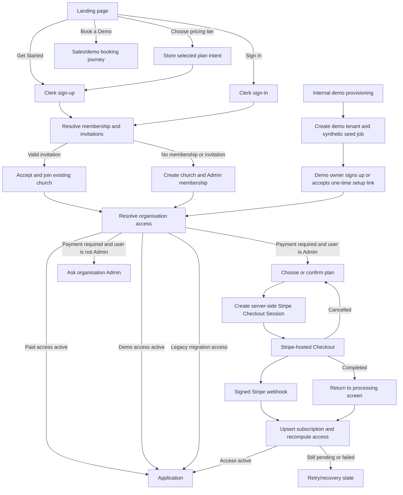

# Onboarding and Stripe Billing Workflow

**Date:** 2026-08-11
**Status:** Proposed workflow
**Scope:** Public Get Started journey, invitation onboarding, Stripe subscription access, and internally provisioned synthetic demo churches

## Outcome

ChurchCoin should support three distinct entry journeys:

1. A new church signs up, creates its organisation, pays through Stripe, and receives access after a verified Stripe event.
2. An invited user signs up or signs in, joins an existing church, and inherits that church's access state without creating another subscription.
3. A ChurchCoin operator provisions a clearly marked demo church containing only synthetic data. The demo tenant receives time-bounded access without creating a Stripe customer or subscription.

The application must not treat "no subscription record" as proof that an organisation is a demo. Billing and demo access must be explicit, server-issued states.

## Product decisions

- **Get Started opens sign-up.** Sign In remains a separate action and opens sign-in.
- **Plan selections survive the journey.** A plan selected on the landing pricing section is remembered through Clerk and onboarding, then shown for confirmation before Stripe Checkout. It is never trusted as a Stripe price ID.
- **An organisation is created before Checkout.** This gives Stripe a stable internal organisation ID and preserves onboarding if Checkout is cancelled.
- **Stripe webhooks grant paid access.** A success URL is a navigation hint, not proof of payment.
- **Only organisation Admins can start Checkout or manage billing.** Other members of an unpaid church see a contact-your-admin state.
- **Demo access is internal-only.** Public sign-up cannot request or set demo mode.
- **Synthetic demo tenants never silently become live tenants.** Conversion creates a clean production church; it may copy non-financial configuration, but never synthetic transactions, donors, pledges, or reconciliations.
- **Existing tenants get an explicit migration state.** Re-enabling the gate must not unexpectedly lock every existing church that was created while billing was disabled.
- **Recommended failed-renewal policy:** allow a seven-day `past_due` grace period with an Admin billing banner, then restrict the tenant to billing recovery. Initial `incomplete` subscriptions never receive access.

## Journey overview



`Book a Demo` is a marketing/sales action. It must not use the public Get Started handler and must not expose the internal synthetic-tenant provisioning capability.

## Canonical state model

### Organisation access mode

Add an explicit, server-controlled access mode to the organisation:

| Mode | Meaning | Access source |
|---|---|---|
| `subscription` | Normal customer church | Stripe subscription state |
| `demo` | Synthetic demonstration tenant | Internal demo grant and optional expiry |
| `legacy` | Temporary migration state for churches created while billing was disabled | Explicit temporary grant |

During rollout, a missing mode should be interpreted as `legacy`, not `subscription`. Existing organisations must be reviewed and backfilled before `legacy` support is removed.

Recommended accompanying fields:

- `dataMode: "live" | "synthetic"`
- `accessMode: "subscription" | "demo" | "legacy"`
- `accessExpiresAt?: number` for demos and temporary grants
- `demoSeedStatus?: "pending" | "ready" | "failed"`
- `demoSeedVersion?: string`

These fields must only be written by trusted server functions. The public organisation-create mutation always sets `accessMode: "subscription"` and `dataMode: "live"`.

### Subscription state

Persist Stripe states without converting unknown values to active:

- `trialing`
- `active`
- `past_due`
- `canceled`
- `incomplete`
- `incomplete_expired`
- `unpaid`
- `paused`

Unknown prices and unknown statuses must fail closed and raise an operational alert. They must never default to Starter or active access.

### Resolved access state

Every client gate and protected server operation should use the same resolver and receive one of:

| Resolved state | Full app access | Billing access | User experience |
|---|---:|---:|---|
| `active_subscription` | Yes | Yes | Normal app |
| `trialing_subscription` | Yes | Yes | Normal app with trial information, if trials are enabled |
| `past_due_grace` | Yes | Yes | Warning banner; Admin is prompted to fix payment |
| `active_demo` | Yes | No Stripe actions | Demo banner and synthetic-data label |
| `legacy_grant` | Yes temporarily | Depends on migration decision | Normal app plus internal migration visibility |
| `payment_required` | No | Admin only | Plan selection for Admin; contact-Admin view for others |
| `payment_processing` | No | Admin only | Bounded processing/retry screen |
| `demo_provisioning` | No | No | Seed progress screen |
| `demo_expired` | No | No | Contact ChurchCoin; do not offer in-place paid conversion |
| `access_revoked` | No | Admin recovery only | Recovery/support state |

The server-side resolver is the security boundary. A React route guard alone is insufficient.

## Workflow A: public Get Started

### 1. Landing intent

When a visitor clicks a CTA:

| Source | Intent captured | Next screen |
|---|---|---|
| Navigation or hero `Get Started` | `{ authMode: "signup" }` | Clerk Sign Up |
| Pricing tier CTA | `{ authMode: "signup", selectedPlan }` | Clerk Sign Up |
| `Sign In` | `{ authMode: "signin" }` | Clerk Sign In |
| `Book a Demo` | Separate sales intent | Booking/contact flow |

Store the selected plan and acquisition source in session/local storage so Clerk redirects do not erase it. Never store a Stripe price ID in client intent.

### 2. Authentication

Clerk owns account creation, email verification, session establishment, and sign-in recovery. After Clerk completes:

Before rollout, enable public sign-ups in the production Clerk instance and verify the allowed sign-up methods, email-verification policy, and post-auth redirect behaviour. Rendering `<SignUp>` in React is not sufficient if the Clerk instance still restricts account creation.

1. Resolve the current Convex user membership.
2. Resolve an invitation token captured before authentication.
3. Query pending invitations for the verified Clerk email.
4. Do not create a ChurchCoin user record until an invitation is accepted or a new organisation is created.

### 3. Membership decision

The ordering is important:

1. A valid link-token invitation takes priority and is shown for explicit acceptance.
2. Otherwise, show pending email-matched invitations.
3. Otherwise, offer to paste an invite link or create a new church.

Accepting an invitation:

- creates membership in the existing organisation;
- does not create a Stripe Customer;
- clears any landing-page selected-plan intent;
- resolves access using the existing organisation's state.

Creating a new church atomically creates:

- organisation with `accessMode: "subscription"` and `dataMode: "live"`;
- the signed-in user as Admin;
- the General Fund;
- standard UK charity categories;
- an audit/domain event for organisation creation.

The organisation is now onboarded but has `payment_required` access until Stripe activates a subscription.

### 4. Plan confirmation

If a pricing tier was selected on the landing page, highlight it but allow the Admin to change it. If there was no selection, show all plans.

The server accepts only the internal enum `starter | growing | thriving`, maps it to configured Stripe prices, and rejects missing or unknown price configuration.

### 5. Checkout Session creation

The server must:

1. Require an authenticated organisation Admin.
2. Resolve the organisation and confirm `accessMode === "subscription"`.
3. Refuse to create a second subscription if an active/trialing subscription already exists.
4. Validate success and cancel origins against `APP_BASE_URL`.
5. Create or reuse the Stripe Customer linked to the organisation.
6. Create a new Checkout Session for each intentional attempt, using a server-generated idempotency key for network retries of that attempt.
7. Put the organisation ID in Customer, Checkout Session, and Subscription metadata.
8. Use a success URL containing Stripe's `{CHECKOUT_SESSION_ID}` placeholder so the processing page can identify the attempt.
9. Record a non-sensitive checkout attempt/audit event.

### 6. Stripe return and webhook

On successful Checkout, the browser returns to a dedicated billing result route, for example:

`/billing/checkout/success?session_id={CHECKOUT_SESSION_ID}`

The page shows a bounded processing state while the reactive access query waits for the webhook. It must not grant access because the URL says `success`.

The signed webhook endpoint:

1. verifies the raw-body Stripe signature;
2. rejects events with missing/unknown organisation IDs, prices, customers, or statuses;
3. handles duplicate and out-of-order events idempotently;
4. persists the Stripe subscription state and period dates;
5. recomputes access;
6. records the Stripe event ID so the same event is not processed twice;
7. returns a non-2xx response on transient processing failure so Stripe retries it.

Required subscription events include:

- `customer.subscription.created`
- `customer.subscription.updated`
- `customer.subscription.deleted`
- `invoice.paid`
- `invoice.payment_failed`
- `checkout.session.completed` for attempt tracking and diagnostics

If the access query has not become active after a short bounded wait, the processing screen should offer **Check again**, **Return to plans**, and support guidance. A server-side reconciliation action may retrieve the Checkout Session/subscription from Stripe, but must validate that it belongs to the caller's organisation.

### 7. Ongoing billing

Restore Billing in Settings for Admins. It should show the current plan, renewal/end date, cancellation schedule, payment-recovery status, and a link to Stripe's Billing Portal.

- `active` and `trialing`: full access.
- cancellation scheduled at period end: full access until Stripe reports the subscription ended.
- `past_due`: seven-day recommended grace period plus prominent Admin recovery banner.
- grace expired, `unpaid`, `paused`, `canceled`, `incomplete`, or `incomplete_expired`: billing-recovery access only.
- non-Admins see status and contact-Admin guidance, not Checkout or portal controls.

## Workflow B: internally provisioned demo church

### Provisioning boundary

The demo path must be an internal action or protected operator tool. It must not be a boolean accepted by public onboarding.

Recommended operator inputs:

- owner email or existing Clerk user ID;
- owner display name;
- fictional church name;
- seed scenario/version;
- optional expiry date;
- optional reset cadence.

For the first implementation, provisioning can be run from the Convex dashboard/CLI after the dedicated demo owner has created a Clerk account. If this becomes frequent, add a one-time operator-created demo setup link as a second iteration.

### Provisioning sequence

1. Validate the target Clerk identity does not already belong to another ChurchCoin organisation. The current product supports one organisation per Clerk user.
2. Atomically create the organisation as `accessMode: "demo"`, `dataMode: "synthetic"`, and `demoSeedStatus: "pending"`.
3. Create the owner membership as Admin.
4. Seed deterministic synthetic data in bounded, retryable batches.
5. Validate referential integrity and expected record counts.
6. Set `demoSeedStatus: "ready"`, seed version, and optional expiry.
7. Grant `active_demo` access without creating a Stripe Customer or subscription.

If seeding fails, keep the tenant in `demo_provisioning` and expose a retry/reset operation to operators. Do not reveal a partially seeded ledger as ready.

### Synthetic dataset rules

The seed should be deterministic and clearly fictional, with no copied production data or real donor PII. A useful baseline contains:

- 12 months of dated income and expenditure;
- unrestricted, restricted, and designated funds;
- recurring and one-off fictional donors;
- Gift Aid eligible and ineligible gifts;
- pledges with active/completed/cancelled states;
- reconciled and unreconciled transactions;
- cash collection and bank deposit examples;
- at least one completed reconciliation;
- data that produces useful dashboard and Copilot insights.

Demo tenants should display a persistent **Synthetic demo data** banner and should not be able to connect a live bank account, create Stripe billing sessions, or send real invitation emails unless a separate operator decision explicitly enables those capabilities.

Provide internal **reset demo** and **reseed demo** operations. Reset must target an exact organisation ID, verify `dataMode === "synthetic"`, and preserve the owner/access metadata while replacing only demo-domain records.

## Domain and analytics events

The events below describe meaningful workflow transitions. Analytics events should contain stable IDs and enums, not names, emails, charity numbers, or Stripe secrets.

| Event | Emitted by | Important properties |
|---|---|---|
| `onboarding.get_started_clicked` | Client | source, selectedPlan? |
| `onboarding.auth_started` | Client | signup/signin, source |
| `onboarding.auth_completed` | Client/server observation | signup/signin |
| `onboarding.invitation_accepted` | Server mutation | organisationId, role, invitationId |
| `onboarding.organization_created` | Server mutation | organisationId, accessMode |
| `billing.plan_selected` | Client | plan, source |
| `billing.checkout_created` | Server action | organisationId, plan, sessionId, attemptId |
| `billing.checkout_completed` | Stripe webhook | organisationId, sessionId, eventId |
| `billing.subscription_changed` | Stripe webhook | organisationId, plan, oldStatus, newStatus, eventId |
| `billing.access_changed` | Server resolver transition/audit | organisationId, oldState, newState, reason |
| `demo.provisioning_started` | Internal server action | organisationId, seedVersion |
| `demo.provisioning_completed` | Internal server action | organisationId, seedVersion, counts |
| `demo.provisioning_failed` | Internal server action | organisationId, safe error code |
| `demo.reset_completed` | Internal server action | organisationId, seedVersion |

Stripe event IDs should be persisted for deduplication. Application event names do not need to be a general-purpose event bus in the first iteration; structured audit records and monitoring breadcrumbs are sufficient.

## Server enforcement

Introduce a shared access resolver, conceptually:

```text
resolveOrganizationAccess(user, organization, subscription, now)
  -> { state, canUseApp, canManageBilling, reason, expiresAt? }
```

Use it in two places:

1. A reactive query used by the root application gate.
2. A `requireAppAccess()` backend helper used by every protected financial query, mutation, and action.

Organisation, membership, invitation, access-status, and Admin billing-recovery functions remain callable when full app access is denied. Public clients must not be able to call demo provisioning or modify access-mode fields.

## Recovery and edge cases

| Situation | Expected result |
|---|---|
| Visitor double-clicks Checkout | One logical attempt is safely retried; no duplicate subscription is created |
| Checkout is cancelled | Organisation remains; Admin returns to plan selection |
| Checkout succeeds but webhook is delayed | Bounded processing state, then retry/reconciliation guidance |
| Webhook is duplicated or arrives out of order | Event ID/timestamp guards prevent stale state overwrite |
| Unknown Stripe price/status | Fail closed, preserve prior valid state, alert operator |
| Invited user joins an active church | Direct access based on the church subscription |
| Invited non-Admin joins an unpaid church | Contact-Admin payment-required screen |
| Admin's renewal payment fails | Grace banner and Billing Portal recovery |
| Demo expires | Demo-expired screen; no in-place conversion of synthetic ledger |
| Existing pre-billing church has no access mode | Temporary legacy access until classified |
| User signs out during onboarding | Intent/invite token survives safely; no partial membership is created |

## Current code gaps

The repository already contains most Stripe building blocks, but the active flow currently has these gaps:

- Landing `Sign In`, `Get Started`, pricing CTAs, and `Book a Demo` converge on the same callback.
- `AuthPage` defaults to sign-in, so Get Started does not actually start sign-up.
- The repository cannot by itself prove that public account creation is enabled in the production Clerk instance; that external setting must be verified during rollout.
- A selected landing-page plan is not retained.
- Organisation creation currently goes straight into the application because the root subscription gate was removed.
- Billing was removed from Settings even though `BillingSettings` still exists.
- The old gate was client-side only; protected Convex operations do not share a billing/demo access resolver.
- `createCheckoutSession` and Billing Portal creation do not currently require the Admin role.
- Unknown Stripe prices default to Starter and unknown statuses default to active; both are unsafe fail-open behaviours.
- The success return uses a query flag without a Checkout Session ID or bounded reconciliation path.
- `checkout.session.completed` is only logged.
- There is no explicit demo access state, seed workflow, expiry/reset lifecycle, or synthetic-data banner.

## Implementation sequence

1. **Access model and migration:** add access/data modes, expand subscription status handling, build the shared resolver, classify existing organisations, and add access tests.
2. **Landing and auth intent:** split Sign In/Get Started/Book a Demo handlers, open the correct Clerk mode, and preserve an optional selected plan.
3. **Onboarding transition:** create subscription-mode churches and route them to resolved access instead of directly into the app; preserve the existing invitation-first flow.
4. **Stripe hardening and gate:** enforce Admin billing actions, fail closed on Stripe mappings, add idempotent Checkout attempts, restore the root gate, enforce backend access, and implement webhook-driven processing/recovery.
5. **Billing settings:** restore Admin billing management and past-due recovery UI.
6. **Demo provisioning:** add internal provisioning, deterministic seed batches, demo banners/restrictions, expiry, reset, and reseed.
7. **Rollout verification:** run the full journey matrix in Stripe test mode, forward webhook events locally, verify production environment variables/webhook registrations, and enable the gate only after existing organisations are classified.

## Acceptance journey matrix

At minimum, automated or repeatable end-to-end checks must cover:

1. Generic Get Started -> sign-up -> create church -> choose plan -> successful Checkout -> app.
2. Pricing-tier CTA -> sign-up -> create church -> selected tier retained -> successful Checkout.
3. Checkout cancellation -> plan screen -> retry succeeds.
4. Successful return before webhook -> processing -> webhook activates access.
5. Duplicate and out-of-order Stripe events do not corrupt access.
6. Invite link -> sign-up -> accept -> active existing church without new Stripe customer.
7. Invited non-Admin -> unpaid church -> contact-Admin state.
8. Active subscription -> cancellation scheduled -> access until period end -> revoked after deletion event.
9. Renewal failure -> grace banner -> portal recovery -> active again.
10. Internal demo provision -> deterministic seed -> demo access with no Stripe objects.
11. Demo reset/reseed -> same scenario and valid references.
12. Demo expiry -> no full access and no paid conversion of synthetic data.
13. Existing unclassified organisation remains on temporary legacy access during migration.
